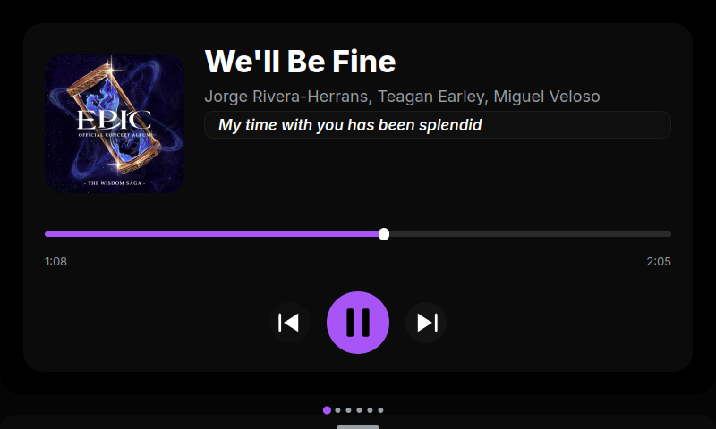

<p align="center">
    
</p>

[](LICENSE)

[](https://deepwiki.com/CodeSoftGit/touchdeck)

Touch-friendly “Stream Deck-like” UI for small landscape displays, focused on quick music controls and system stats.

Docs/Website availible at <https://touchdeck.codesft.dev/>



## What it does

- Now Playing page with transport + seek using MPRIS over D-Bus (Linux-first; Windows is experimental)
- Live lyrics using LRCLIB
- System Stats page (CPU/RAM + optional NVIDIA GPU via NVML)
- Speedtest page powered by `speedtest-cli`
- Clock page with 12/24h and optional seconds
- Themes and swipe navigation, tuned for 800x480 touch displays
- Swipe-up drawer with configurable quick actions

> [!WARNING]
> touchdeck is early-stage software. Expect rough edges and please report issues with steps.

## Requirements

- Python 3.10+
- Linux desktop with D-Bus and an MPRIS-compatible player running (Spotify, VLC, etc.)
- PySide6 runtime (installed via dependencies)
- A small landscape display (defaults to 800x480) with touch input

## Install

### Using uv (recommended)

```bash
uv venv
uv sync
```

### Using pip

```bash
python -m venv .venv
source .venv/bin/activate
pip install -U pip
pip install -e .
```

## Run

```bash
uv run touchdeck        # if installed via uv
touchdeck               # if installed via pip
# or
python -m touchdeck
```

## As a developer

### Installing

Use uv.

```bash
uv venv
uv sync --dev
```

### Testing
Without generating a coverage report:

```bash
uv run pytest
```

Generating a coverage report:

```bash
uv run pytest --cov --cov-branch --cov-report=xml --cov-report html:cov_html
```

## Configuration

- Settings are stored at `~/.config/touchdeck/settings.json` (created on first save).
- The touchdeck UI lets you configure them in the settings page.

## Troubleshooting

- No Now Playing data: ensure a D-Bus/MPRIS-compatible player is running.
- GPU stats empty: install `nvidia-ml-py` and confirm NVML is available, or set `enable_gpu_stats` to false.
- Qt cannot open a display: run under X/Wayland with a reachable display and touch input.
- Speedtest errors: requires network access; try again or skip the Speedtest page.

## Development

- Follow the setup in `CONTRIBUTING.md`.
- Run locally with `uv run touchdeck` (or `python -m touchdeck` in an activated venv).
- Update `CHANGELOG.md` for user-visible changes.

## Credits

- Uses Google Noto Color Emoji
- Built with Python and PySide6

## License

touchdeck is licensed under the MIT License. See `LICENSE` for details.

### Logo license

The “touchdeck” logo is © 2025 codesft. It is licensed under
Creative Commons Attribution–NoDerivatives 4.0 International (CC BY-ND 4.0):
https://creativecommons.org/licenses/by-nd/4.0/

You may use and redistribute unmodified copies of the logo (including for commercial purposes),
as long as you provide attribution. Do not share modified versions.
